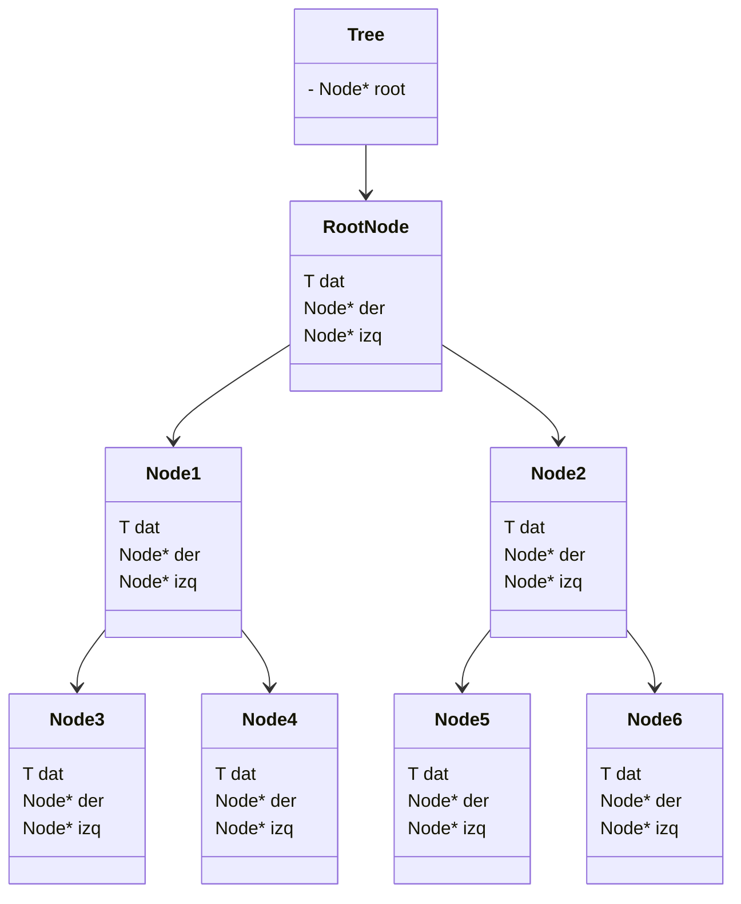

# Binary Search Tree (BST)

## Introduction
The Binary Search Tree (BST) is a Data Structure (DS) that has at most 2 nodes each node. The main reason for using this DS is because when we are working with large 
data, it is a commun situation that operations on the buffer (temporary storage for data in a program) become slow because of the way it is aproache accesing, 
deleting and inserting data, among others operations.  
Because of this reasons, it is necessary to have other ways of doing this operations in a more robust and better DS.
## Explanation
So the main idea for BSTs is to have at most 2 nodes like it was mention before. The main goal is to have a root node which will be the main comparison betwean the 
other nodes. So for example if we enter 3 nodes. The first node will be the root, and the other 2 nodes will be sorted respect to the root node
## Design
### Node
So for the node we will need to have 2 *`references`* to another 2 arbitrary nodes. So the definition of the **class Node** and the source code placed in the **`.
h`** file is the following.  
### `nodoBinario.h` 
```cpp
template <typename T> class ArbolBin;
template <typename T>
class NodoBin{
  friend class ArbolBin<T>;
private:
  T dato;
  NodoBin* izq;
  NodoBin* der;
  void eraseNode(NodoBin*, NodoBin*);
  bool leaf() const;
  ~NodoBin();
  NodoBin(const T&, NodoBin* const = NULL, NodoBin* const = NULL);
  void insert(const T&, NodoBin*&);
  void pop(const T&, NodoBin*&, NodoBin*&);
  void pop(const T&, NodoBin*&);
  void inOrden(const NodoBin* const) const;
  void inOrden(Queue<T>&, const NodoBin* const);
  void preOrden(const NodoBin* const) const;
  void preOrden(Queue<T>&, const NodoBin* const);
  void posOrden(const NodoBin* const) const;
  void posOrden(Queue<T>&, const NodoBin* const);
  void nivelOrden(const NodoBin* const);
  void nivelOrden(Queue<T>&, const NodoBin* const);
protected:
public:
};
```
## Tree
The Tree desing was just making a `Node` the `Root Node`, which again will be the source or the start point in our tree. So the definition of the **class Tree** and 
the source code placed in the **`.h`** file is the following.  
### `arbolBinario.h` 
```cpp
template <typename T>
class ArbolBin{
private:
  NodoBin<T>* raiz;
  size_t numItems;
protected:
public:
  ArbolBin();
  ArbolBin(const T&);
  ArbolBin(const ArbolBin&);
  void insert(const T&);
  void pop(const T&);
  void inOrden() const;
  void inOrden(Queue<T>&);
  void preOrden() const;
  void preOrden(Queue<T>&);
  void posOrden() const;
  void posOrden(Queue<T>&);
  void nivelOrden() const;
  void nivelOrden(Queue<T>&);
  size_t size() const;
  bool empty() const;
  ArbolBin<T>& operator = (const ArbolBin&);
};
```
## Diagram


## Relations
```
```